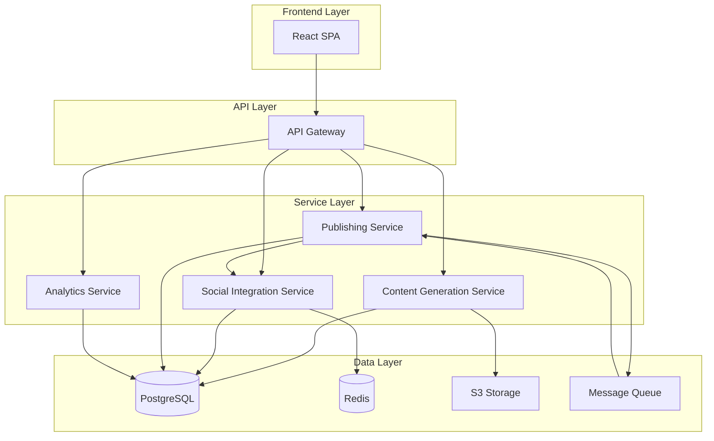

# Design Document: Social Media Creator Platform

## Overview

The Social Media Creator Platform is a full-stack web application that provides creators with an integrated environment for content creation, publishing, and analytics. The system architecture follows a microservices pattern with clear separation between content generation, social media integration, publishing orchestration, and analytics processing.

The platform consists of:
- **Frontend Application**: React-based SPA providing the creator interface
- **API Gateway**: Central routing and authentication layer
- **Content Generation Service**: AI-powered content creation using LLM APIs
- **Social Media Integration Service**: OAuth management and platform API interactions
- **Publishing Service**: Scheduling and publishing orchestration
- **Analytics Service**: Data collection, processing, and insight generation
- **Database Layer**: PostgreSQL for structured data, S3 for media storage

## Architecture

### System Components



### Component Responsibilities

**Frontend Application**:
- User interface for all creator interactions
- Content editor with rich text and media support
- Calendar view for scheduled content
- Analytics dashboards and visualizations
- Real-time updates via WebSocket connections

**API Gateway**:
- Request routing to appropriate services
- JWT-based authentication and authorization
- Rate limiting and request validation
- API versioning and documentation

**Content Generation Service**:
- Integration with OpenAI GPT-4 for text generation
- Integration with DALL-E 3 or Midjourney for image generation
- Prompt engineering for platform-specific content
- Content variation generation
- Template management for consistent outputs

**Social Media Integration Service**:
- OAuth 2.0 flow implementation for each platform
- Token management and refresh logic
- Platform API clients (Instagram Graph API, LinkedIn API, X API v2, YouTube Data API)
- Webhook handlers for real-time updates
- Rate limit management per platform

**Publishing Service**:
- Scheduling engine with cron-based job processing
- Content queue management
- Retry logic for failed publications
- Multi-platform publishing coordination
- Publication status tracking

**Analytics Service**:
- Periodic data fetching from platform APIs
- Metrics aggregation and storage
- Time-series data processing
- ML-based insight generation
- Recommendation engine for optimal posting times

## Components and Interfaces

### Content Generation Service

**Interface: ContentGenerationAPI**

```typescript
interface ContentGenerationAPI {
  generatePost(request: PostGenerationRequest): Promise<PostGenerationResponse>
  generateBlog(request: BlogGenerationRequest): Promise<BlogGenerationResponse>
  generateScript(request: ScriptGenerationRequest): Promise<ScriptGenerationResponse>
  generateVisual(request: VisualGenerationRequest): Promise<VisualGenerationResponse>
  generateCarousel(request: CarouselGenerationRequest): Promise<CarouselGenerationResponse>
  generateThumbnail(request: ThumbnailGenerationRequest): Promise<ThumbnailGenerationResponse>
}

interface PostGenerationRequest {
  userId: string
  topic: string
  platform: 'instagram' | 'linkedin' | 'x'
  tone?: 'professional' | 'casual' | 'inspirational' | 'educational'
  length?: 'short' | 'medium' | 'long'
  includeHashtags: boolean
  includeCTA: boolean
  variationCount?: number
}

interface PostGenerationResponse {
  variations: Array<{
    id: string
    content: string
    hashtags: string[]
    cta?: string
    estimatedLength: number
  }>
  generatedAt: Date
}

interface CarouselGenerationRequest {
  userId: string
  topic: string
  platform: 'instagram' | 'linkedin'
  slideCount: number
  designStyle?: string
  tone?: string
}

interface CarouselGenerationResponse {
  carouselId: string
  slides: Array<{
    slideNumber: number
    textContent: string
    visualPrompt: string
    imageUrl?: string
  }>
  generatedAt: Date
}
```

**Implementation Details**:
- Uses OpenAI GPT-4 API with custom system prompts per content type
- Implements prompt templates with variable substitution
- Caches common generation patterns in Redis
- Implements retry logic with exponential backoff for API failures
- Validates generated content against platform constraints

### Social Media Integration Service

**Interface: SocialIntegrationAPI**

```typescript
interface SocialIntegrationAPI {
  initiateOAuth(platform: SocialPlatform, userId: string): Promise<OAuthURL>
  handleOAuthCallback(code: string, state: string): Promise<AccountConnection>
  disconnectAccount(accountId: string): Promise<void>
  refreshAccessToken(accountId: string): Promise<void>
  getConnectedAccounts(userId: string): Promise<AccountConnection[]>
  publishContent(request: PublishRequest): Promise<PublishResponse>
  fetchMetrics(accountId: string, contentId: string): Promise<EngagementMetrics>
}

interface AccountConnection {
  id: string
  userId: string
  platform: SocialPlatform
  platformUserId: string
  platformUsername: string
  accessToken: string
  refreshToken?: string
  expiresAt: Date
  connectedAt: Date
}

interface PublishRequest {
  accountId: string
  contentType: 'post' | 'blog' | 'carousel'
  content: string
  mediaUrls?: string[]
  scheduledFor?: Date
}

interface PublishResponse {
  success: boolean
  platformPostId?: string
  publishedUrl?: string
  error?: string
}

interface EngagementMetrics {
  contentId: string
  reach: number
  impressions: number
  likes: number
  comments: number
  shares: number
  fetchedAt: Date
}
```

**Implementation Details**:
- Separate OAuth client for each platform with platform-specific scopes
- Encrypted token storage using AES-256
- Token refresh scheduled 1 hour before expiration
- Platform-specific API clients with unified interface
- Webhook endpoints for real-time metric updates
- Rate limiting per platform (Instagram: 200/hour, LinkedIn: 500/day, X: 300/15min)

### Publishing Service

**Interface: PublishingAPI**

```typescript
interface PublishingAPI {
  scheduleContent(request: ScheduleRequest): Promise<ScheduledContent>
  cancelScheduled(scheduledId: string): Promise<void>
  updateScheduled(scheduledId: string, updates: Partial<ScheduleRequest>): Promise<ScheduledContent>
  getScheduledContent(userId: string, filters?: ScheduleFilters): Promise<ScheduledContent[]>
  publishNow(contentId: string, accountIds: string[]): Promise<PublishResult[]>
}

interface ScheduleRequest {
  userId: string
  contentId: string
  accountIds: string[]
  scheduledFor: Date
  timezone: string
}

interface ScheduledContent {
  id: string
  userId: string
  contentId: string
  accountIds: string[]
  scheduledFor: Date
  status: 'pending' | 'processing' | 'published' | 'failed' | 'cancelled'
  createdAt: Date
}

interface PublishResult {
  accountId: string
  success: boolean
  platformPostId?: string
  error?: string
}
```

**Implementation Details**:
- Uses Bull queue with Redis for job scheduling
- Cron job runs every minute to check for due publications
- Implements retry logic: 3 attempts with 5-minute intervals
- Sends notifications on publication success/failure
- Maintains publication history for audit trail
- Supports bulk operations for multi-platform publishing

### Analytics Service

**Interface: AnalyticsAPI**

```typescript
interface AnalyticsAPI {
  getPostMetrics(contentId: string): Promise<PostMetrics>
  getFollowerGrowth(accountId: string, period: TimePeriod): Promise<GrowthData>
  getOptimalPostingTimes(accountId: string): Promise<PostingRecommendations>
  getContentInsights(userId: string): Promise<ContentInsights>
  refreshMetrics(accountId: string): Promise<void>
}

interface PostMetrics {
  contentId: string
  accountId: string
  reach: number
  impressions: number
  likes: number
  comments: number
  shares: number
  engagementRate: number
  lastUpdated: Date
}

interface GrowthData {
  accountId: string
  period: TimePeriod
  dataPoints: Array<{
    date: Date
    followerCount: number
    change: number
  }>
  totalGrowth: number
  growthRate: number
}

interface PostingRecommendations {
  accountId: string
  recommendations: Array<{
    dayOfWeek: number
    hour: number
    confidence: number
    averageEngagement: number
  }>
  lastUpdated: Date
}

interface ContentInsights {
  userId: string
  topPerformingTopics: string[]
  bestContentFormats: Array<{
    format: string
    avgEngagement: number
  }>
  toneRecommendations: string[]
  underperformingContent: Array<{
    contentId: string
    issue: string
    suggestion: string
  }>
  generatedAt: Date
}
```

**Implementation Details**:
- Scheduled jobs fetch metrics every 6 hours from platform APIs
- Time-series data stored in PostgreSQL with TimescaleDB extension
- ML model (scikit-learn) for posting time recommendations
- Natural language processing for topic extraction
- Aggregation queries optimized with materialized views
- Real-time updates via WebSocket for active content

## Data Models

### Database Schema

**users**
```sql
CREATE TABLE users (
  id UUID PRIMARY KEY DEFAULT gen_random_uuid(),
  email VARCHAR(255) UNIQUE NOT NULL,
  password_hash VARCHAR(255) NOT NULL,
  name VARCHAR(255),
  timezone VARCHAR(50) DEFAULT 'UTC',
  created_at TIMESTAMP DEFAULT NOW(),
  updated_at TIMESTAMP DEFAULT NOW()
);
```

**social_accounts**
```sql
CREATE TABLE social_accounts (
  id UUID PRIMARY KEY DEFAULT gen_random_uuid(),
  user_id UUID REFERENCES users(id) ON DELETE CASCADE,
  platform VARCHAR(50) NOT NULL,
  platform_user_id VARCHAR(255) NOT NULL,
  platform_username VARCHAR(255),
  access_token TEXT NOT NULL,
  refresh_token TEXT,
  token_expires_at TIMESTAMP,
  connected_at TIMESTAMP DEFAULT NOW(),
  last_synced_at TIMESTAMP,
  UNIQUE(platform, platform_user_id)
);
```

**content**
```sql
CREATE TABLE content (
  id UUID PRIMARY KEY DEFAULT gen_random_uuid(),
  user_id UUID REFERENCES users(id) ON DELETE CASCADE,
  content_type VARCHAR(50) NOT NULL,
  title VARCHAR(500),
  body TEXT,
  metadata JSONB,
  status VARCHAR(50) DEFAULT 'draft',
  created_at TIMESTAMP DEFAULT NOW(),
  updated_at TIMESTAMP DEFAULT NOW()
);
```

**content_media**
```sql
CREATE TABLE content_media (
  id UUID PRIMARY KEY DEFAULT gen_random_uuid(),
  content_id UUID REFERENCES content(id) ON DELETE CASCADE,
  media_type VARCHAR(50) NOT NULL,
  media_url TEXT NOT NULL,
  storage_key VARCHAR(500) NOT NULL,
  order_index INTEGER,
  metadata JSONB,
  created_at TIMESTAMP DEFAULT NOW()
);
```

**scheduled_publications**
```sql
CREATE TABLE scheduled_publications (
  id UUID PRIMARY KEY DEFAULT gen_random_uuid(),
  user_id UUID REFERENCES users(id) ON DELETE CASCADE,
  content_id UUID REFERENCES content(id) ON DELETE CASCADE,
  account_id UUID REFERENCES social_accounts(id) ON DELETE CASCADE,
  scheduled_for TIMESTAMP NOT NULL,
  timezone VARCHAR(50) NOT NULL,
  status VARCHAR(50) DEFAULT 'pending',
  attempts INTEGER DEFAULT 0,
  last_error TEXT,
  created_at TIMESTAMP DEFAULT NOW(),
  published_at TIMESTAMP
);
```

**publications**
```sql
CREATE TABLE publications (
  id UUID PRIMARY KEY DEFAULT gen_random_uuid(),
  content_id UUID REFERENCES content(id) ON DELETE CASCADE,
  account_id UUID REFERENCES social_accounts(id) ON DELETE CASCADE,
  platform_post_id VARCHAR(255),
  platform_url TEXT,
  published_at TIMESTAMP DEFAULT NOW(),
  metadata JSONB
);
```

**engagement_metrics**
```sql
CREATE TABLE engagement_metrics (
  id UUID PRIMARY KEY DEFAULT gen_random_uuid(),
  publication_id UUID REFERENCES publications(id) ON DELETE CASCADE,
  reach INTEGER DEFAULT 0,
  impressions INTEGER DEFAULT 0,
  likes INTEGER DEFAULT 0,
  comments INTEGER DEFAULT 0,
  shares INTEGER DEFAULT 0,
  engagement_rate DECIMAL(5,2),
  fetched_at TIMESTAMP DEFAULT NOW()
);

CREATE INDEX idx_metrics_publication ON engagement_metrics(publication_id);
CREATE INDEX idx_metrics_fetched ON engagement_metrics(fetched_at DESC);
```

**follower_snapshots**
```sql
CREATE TABLE follower_snapshots (
  id UUID PRIMARY KEY DEFAULT gen_random_uuid(),
  account_id UUID REFERENCES social_accounts(id) ON DELETE CASCADE,
  follower_count INTEGER NOT NULL,
  snapshot_date DATE NOT NULL,
  created_at TIMESTAMP DEFAULT NOW(),
  UNIQUE(account_id, snapshot_date)
);

CREATE INDEX idx_snapshots_account_date ON follower_snapshots(account_id, snapshot_date DESC);
```

**content_insights**
```sql
CREATE TABLE content_insights (
  id UUID PRIMARY KEY DEFAULT gen_random_uuid(),
  user_id UUID REFERENCES users(id) ON DELETE CASCADE,
  insight_type VARCHAR(100) NOT NULL,
  insight_data JSONB NOT NULL,
  confidence_score DECIMAL(3,2),
  generated_at TIMESTAMP DEFAULT NOW()
);
```

### Data Flow

**Content Creation Flow**:
1. Creator provides input (topic, preferences) via UI
2. Frontend sends request to API Gateway
3. Gateway routes to Content Generation Service
4. Service calls LLM API with engineered prompts
5. Generated content stored in `content` table with status 'draft'
6. Media assets uploaded to S3, references stored in `content_media`
7. Response returned to frontend with content preview

**Publishing Flow**:
1. Creator selects content and target accounts
2. If immediate: Publishing Service calls Social Integration Service directly
3. If scheduled: Job added to Bull queue with scheduled time
4. At scheduled time: Queue worker processes job
5. Publishing Service retrieves content and account credentials
6. Social Integration Service posts to platform API
7. Platform response stored in `publications` table
8. Success/failure notification sent to creator

**Analytics Flow**:
1. Cron job triggers metrics fetch every 6 hours
2. Analytics Service queries Social Integration Service for each publication
3. Platform APIs return current metrics
4. Metrics stored in `engagement_metrics` with timestamp
5. Aggregation queries calculate insights
6. ML model processes historical data for recommendations
7. Insights stored in `content_insights` table
8. Frontend polls or receives WebSocket updates


## Correctness Properties

*A property is a characteristic or behavior that should hold true across all valid executions of a system—essentially, a formal statement about what the system should do. Properties serve as the bridge between human-readable specifications and machine-verifiable correctness guarantees.*

### Authentication and Account Management Properties

**Property 1: OAuth Authentication Initiation**
*For any* platform connection attempt, the system should initiate an OAuth 2.0 authentication flow with the appropriate authorization endpoint for that platform.
**Validates: Requirements 1.2**

**Property 2: Secure Credential Storage**
*For any* successfully connected social account, the stored access token should be encrypted using AES-256 encryption before persisting to the database.
**Validates: Requirements 1.3**

**Property 3: Account Display Completeness**
*For any* user with N connected social accounts, querying the management interface should return exactly N account records.
**Validates: Requirements 1.4**

**Property 4: Account Disconnection Cleanup**
*For any* connected social account, when disconnected, the account record should be removed from the database and no access tokens should remain in storage.
**Validates: Requirements 1.5**

**Property 5: Token Expiration Detection**
*For any* social account with an expired access token (current time > token_expires_at), attempting to use that account should trigger a re-authentication prompt.
**Validates: Requirements 1.6**

### Content Generation Properties

**Property 6: Platform-Specific Content Generation**
*For any* topic and target platform combination, the content generator should produce output that includes platform-specific formatting and constraints.
**Validates: Requirements 2.1**

**Property 7: Tone Matching**
*For any* content generation request with a specified tone, the generated content should be tagged with that tone in the response metadata.
**Validates: Requirements 2.2**

**Property 8: Platform Length Constraints**
*For any* post generated for X (Twitter), the content length should not exceed 280 characters.
**Validates: Requirements 2.3**

**Property 9: Hashtag Inclusion**
*For any* post generation request with includeHashtags=true, the response should contain at least one hashtag in the hashtags array.
**Validates: Requirements 2.4**

**Property 10: CTA Inclusion**
*For any* post generation request with includeCTA=true, the response should contain a non-empty CTA field.
**Validates: Requirements 2.5**

**Property 11: Variation Count**
*For any* content generation request with variationCount=N, the response should contain exactly N variations.
**Validates: Requirements 2.7**

**Property 12: Blog Structure Completeness**
*For any* generated blog, the content should contain identifiable introduction, body, and conclusion sections when parsed.
**Validates: Requirements 3.1**

**Property 13: Outline Expansion**
*For any* blog generation from an outline with N sections, the generated blog should contain N corresponding expanded sections.
**Validates: Requirements 3.2**

**Property 14: Blog Minimum Length**
*For any* generated blog, the word count should be greater than or equal to 500 words.
**Validates: Requirements 3.3**

**Property 15: Blog Metadata Completeness**
*For any* generated blog, the response should include both a non-empty title field and a non-empty metaDescription field.
**Validates: Requirements 3.5**

**Property 16: Visual Aspect Ratio**
*For any* generated visual, the image dimensions should maintain a 4:3 aspect ratio (width/height = 1.333... with tolerance of 0.01).
**Validates: Requirements 4.1**

**Property 17: Visual Persistence**
*For any* generated visual, the image should be stored in S3 and a corresponding record should exist in the content_media table with a valid storage_key.
**Validates: Requirements 4.5**

**Property 18: Script Structure Completeness**
*For any* generated script, the content should contain three distinct sections: hooks, talking_points, and scene_breakdowns.
**Validates: Requirements 5.1**

**Property 19: Script Hook Timing**
*For any* generated script, the hook section should have an estimated_time field with a value less than or equal to 3 seconds.
**Validates: Requirements 5.2**

**Property 20: Script Talking Points Count**
*For any* generated script, the number of talking points should be between 3 and 7 (inclusive).
**Validates: Requirements 5.3**

**Property 21: Script Scene Visual Descriptions**
*For any* generated script, each scene in the scene_breakdowns array should contain a non-empty visual_description field.
**Validates: Requirements 5.4**

**Property 22: Script Section Timing**
*For any* generated script, each section (hook, talking points, scenes) should include an estimated_time field with a positive value.
**Validates: Requirements 5.6**

**Property 23: Carousel Slide Count Bounds**
*For any* generated carousel, the number of slides should be between 2 and 10 (inclusive).
**Validates: Requirements 14.1**

**Property 24: Carousel Slide Completeness**
*For any* generated carousel, each slide should contain both a non-empty textContent field and either a visualPrompt or imageUrl field.
**Validates: Requirements 14.2**

**Property 25: Carousel Dimensions**
*For any* carousel generated for Instagram or LinkedIn, each slide image should have dimensions of exactly 1080x1080 pixels.
**Validates: Requirements 14.6**

### Publishing and Scheduling Properties

**Property 26: Immediate Publishing**
*For any* content item and connected social account, when publishNow is called, a publication request should be sent to the platform API within 5 seconds.
**Validates: Requirements 6.1**

**Property 27: Visual Attachment**
*For any* content item with associated media in content_media table, the publishing request should include the media URLs in the mediaUrls array.
**Validates: Requirements 6.4**

**Property 28: Publishing Failure Handling**
*For any* failed publication attempt, the content status should remain 'draft' and the error message should be stored in the scheduled_publications.last_error field.
**Validates: Requirements 6.5**

**Property 29: Publishing Success Response**
*For any* successful publication, the response should include both a non-empty platformPostId and a non-empty publishedUrl.
**Validates: Requirements 6.6**

**Property 30: Scheduled Publication Execution**
*For any* scheduled publication where current_time >= scheduled_for, the publishing service should process that publication within 60 seconds.
**Validates: Requirements 7.2**

**Property 31: Calendar Display Completeness**
*For any* user with N scheduled publications, querying the calendar view should return exactly N scheduled items.
**Validates: Requirements 7.3**

**Property 32: Pre-Publication Modification**
*For any* scheduled publication where current_time < scheduled_for, update and cancel operations should succeed and modify the scheduled_publications record.
**Validates: Requirements 7.4**

**Property 33: Scheduled Failure Notification**
*For any* scheduled publication that fails, a notification record should be created and the content status should revert to 'draft'.
**Validates: Requirements 7.5**

**Property 34: Timezone Handling**
*For any* scheduled publication with timezone T, the scheduled_for timestamp should be correctly converted from timezone T to UTC for storage.
**Validates: Requirements 7.6**

### Analytics Properties

**Property 35: Metrics Tracking Initiation**
*For any* content item that transitions to 'published' status, a corresponding record should be created in the engagement_metrics table within 5 minutes.
**Validates: Requirements 8.1**

**Property 36: Engagement Metrics Completeness**
*For any* published post, querying its metrics should return all five engagement fields: reach, impressions, likes, comments, and shares (values may be zero but fields must exist).
**Validates: Requirements 8.2, 8.3, 8.4**

**Property 37: Daily Follower Snapshots**
*For any* connected social account, there should exist at most one follower_snapshots record per calendar date.
**Validates: Requirements 9.1**

**Property 38: Growth Trend Calculation**
*For any* account with follower snapshots spanning N days, querying growth for that period should return N data points with calculated change values.
**Validates: Requirements 9.2**

**Property 39: Growth Rate Formula**
*For any* two follower snapshots, the calculated growth rate should equal ((new_count - old_count) / old_count) * 100.
**Validates: Requirements 9.3**

**Property 40: Graph Data Structure**
*For any* follower growth query, the response should include a dataPoints array where each element contains date, followerCount, and change fields.
**Validates: Requirements 9.4**

**Property 41: Posting Time Recommendations**
*For any* social account with at least 30 published posts, the analytics engine should generate posting time recommendations with at least one recommendation per day of week.
**Validates: Requirements 10.1, 10.2**

**Property 42: Recommendation Structure**
*For any* posting time recommendation, it should include dayOfWeek (0-6), hour (0-23), and confidence (0.0-1.0) fields.
**Validates: Requirements 10.4, 10.5**

**Property 43: Content Performance Analysis**
*For any* user with at least 10 published content items, the analytics engine should generate content insights including at least one entry in topPerformingTopics.
**Validates: Requirements 11.1, 11.2**

**Property 44: Format Performance Ranking**
*For any* content insights response, the bestContentFormats array should be sorted in descending order by avgEngagement.
**Validates: Requirements 11.3**

**Property 45: Tone Recommendations**
*For any* user with published content, the insights should include a toneRecommendations array with at least one recommended tone.
**Validates: Requirements 11.4**

**Property 46: Underperformance Identification**
*For any* content item in the underperformingContent array, the record should include contentId, issue, and suggestion fields, all non-empty.
**Validates: Requirements 11.5**

### Thumbnail and Media Properties

**Property 47: YouTube Thumbnail Extraction**
*For any* valid YouTube video URL (matching pattern youtube.com/watch?v= or youtu.be/), the platform should successfully extract and return a thumbnail image URL.
**Validates: Requirements 12.4**

**Property 48: Thumbnail Dimensions**
*For any* generated YouTube thumbnail, the image dimensions should be exactly 1280x720 pixels.
**Validates: Requirements 12.7**

### Draft Management Properties

**Property 49: Draft Persistence Completeness**
*For any* draft save operation, all content fields (title, body, metadata) and associated media records should be persisted to the database.
**Validates: Requirements 13.1, 13.5**

**Property 50: Draft Retrieval Completeness**
*For any* user with N draft content items, querying the drafts section should return exactly N items with status='draft'.
**Validates: Requirements 13.3**

### Multi-Platform Properties

**Property 51: Platform Variation Cardinality**
*For any* multi-platform content request targeting N platforms, the response should contain exactly N platform-specific variations.
**Validates: Requirements 15.1**

**Property 52: Independent Variation Editing**
*For any* multi-platform content with N variations, each variation should have a unique ID allowing independent modification without affecting other variations.
**Validates: Requirements 15.3**

**Property 53: Bulk Operation Atomicity**
*For any* bulk publishing operation targeting N accounts, either all N publications should be scheduled/published, or none should be (all-or-nothing).
**Validates: Requirements 15.4**

**Property 54: Variation Tracking**
*For any* multi-platform publication, each publication record should include metadata mapping the specific variation ID to the social account ID.
**Validates: Requirements 15.5**


## Error Handling

### Error Categories

**Authentication Errors**:
- OAuth flow failures (user denial, invalid state, expired authorization codes)
- Token refresh failures (revoked access, invalid refresh token)
- Platform API authentication errors (401, 403 responses)

**Content Generation Errors**:
- LLM API failures (rate limits, service unavailable, timeout)
- Invalid input validation (empty prompts, unsupported platforms)
- Content policy violations (flagged by AI safety filters)
- Image generation failures (DALL-E quota exceeded, inappropriate content)

**Publishing Errors**:
- Platform API errors (rate limits, invalid content format, media upload failures)
- Network timeouts and connectivity issues
- Account permission errors (insufficient scopes, account suspended)
- Content validation errors (exceeds character limits, invalid media format)

**Analytics Errors**:
- Platform API data fetch failures
- Insufficient data for analysis (not enough historical posts)
- Calculation errors (division by zero in growth rate)

### Error Handling Strategies

**Retry Logic**:
- Exponential backoff for transient failures (network errors, 5xx responses)
- Maximum 3 retry attempts with delays: 5s, 15s, 45s
- No retry for client errors (4xx responses except 429 rate limits)
- Retry with token refresh for 401 authentication errors

**Graceful Degradation**:
- Return partial results when some platforms fail in multi-platform operations
- Display cached analytics data when real-time fetch fails
- Allow content creation even when analytics service is unavailable
- Queue publications for retry when platform APIs are temporarily down

**User Communication**:
- Clear, actionable error messages (avoid technical jargon)
- Specific guidance for resolution (e.g., "Reconnect your Instagram account")
- Error codes for support reference
- Notification system for asynchronous failures (scheduled publications)

**Error Logging and Monitoring**:
- Structured logging with correlation IDs for request tracing
- Error aggregation and alerting for critical failures
- Platform API error rate monitoring
- User-facing error analytics to identify common issues

### Error Response Format

```typescript
interface ErrorResponse {
  error: {
    code: string
    message: string
    details?: Record<string, any>
    retryable: boolean
    userAction?: string
  }
}

// Example error responses
{
  error: {
    code: "OAUTH_FAILED",
    message: "Failed to connect Instagram account",
    details: { platform: "instagram", reason: "user_denied" },
    retryable: true,
    userAction: "Please try connecting your account again"
  }
}

{
  error: {
    code: "CONTENT_TOO_LONG",
    message: "Post exceeds platform character limit",
    details: { platform: "x", limit: 280, actual: 315 },
    retryable: false,
    userAction: "Please shorten your post to 280 characters or less"
  }
}

{
  error: {
    code: "RATE_LIMIT_EXCEEDED",
    message: "Instagram API rate limit reached",
    details: { resetAt: "2024-01-15T14:30:00Z" },
    retryable: true,
    userAction: "Please try again after 2:30 PM"
  }
}
```

## Testing Strategy

### Overview

The testing strategy employs a dual approach combining unit tests for specific scenarios and property-based tests for universal correctness guarantees. This ensures both concrete behavior validation and comprehensive input coverage.

### Property-Based Testing

**Framework**: fast-check (for TypeScript/JavaScript services)

**Configuration**:
- Minimum 100 iterations per property test
- Seed-based reproducibility for failed test cases
- Shrinking enabled to find minimal failing examples
- Timeout: 30 seconds per property test

**Property Test Organization**:
- Each correctness property from the design document maps to one property-based test
- Tests tagged with format: `Feature: social-media-creator-platform, Property N: [property title]`
- Grouped by service (Content Generation, Publishing, Analytics, etc.)
- Generators created for domain objects (posts, accounts, schedules, metrics)

**Example Property Test Structure**:

```typescript
// Feature: social-media-creator-platform, Property 8: Platform Length Constraints
describe('Content Generation Properties', () => {
  it('should generate X posts within 280 character limit', async () => {
    await fc.assert(
      fc.asyncProperty(
        fc.string({ minLength: 10, maxLength: 500 }), // topic
        fc.constantFrom('professional', 'casual', 'inspirational', 'educational'), // tone
        async (topic, tone) => {
          const request: PostGenerationRequest = {
            userId: 'test-user',
            topic,
            platform: 'x',
            tone,
            includeHashtags: true,
            includeCTA: true
          };
          
          const response = await contentGenService.generatePost(request);
          
          // Property: All X posts must be <= 280 characters
          response.variations.forEach(variation => {
            expect(variation.content.length).toBeLessThanOrEqual(280);
          });
        }
      ),
      { numRuns: 100 }
    );
  });
});
```

**Custom Generators**:

```typescript
// Generator for social accounts
const socialAccountArb = fc.record({
  id: fc.uuid(),
  userId: fc.uuid(),
  platform: fc.constantFrom('instagram', 'linkedin', 'x', 'youtube'),
  platformUserId: fc.string({ minLength: 5, maxLength: 20 }),
  platformUsername: fc.string({ minLength: 3, maxLength: 30 }),
  accessToken: fc.string({ minLength: 32, maxLength: 128 }),
  expiresAt: fc.date({ min: new Date(), max: new Date('2025-12-31') })
});

// Generator for content items
const contentItemArb = fc.record({
  id: fc.uuid(),
  userId: fc.uuid(),
  contentType: fc.constantFrom('post', 'blog', 'script', 'carousel'),
  title: fc.string({ minLength: 5, maxLength: 200 }),
  body: fc.string({ minLength: 10, maxLength: 5000 }),
  status: fc.constantFrom('draft', 'scheduled', 'published')
});

// Generator for engagement metrics
const metricsArb = fc.record({
  reach: fc.nat({ max: 1000000 }),
  impressions: fc.nat({ max: 5000000 }),
  likes: fc.nat({ max: 100000 }),
  comments: fc.nat({ max: 10000 }),
  shares: fc.nat({ max: 50000 })
});
```

### Unit Testing

**Framework**: Jest (for TypeScript/JavaScript services)

**Focus Areas**:
- Specific examples demonstrating correct behavior
- Edge cases (empty inputs, boundary values, null handling)
- Error conditions and exception handling
- Integration points between services
- Database transaction behavior
- Mock external API responses

**Unit Test Organization**:
- One test file per service/component
- Grouped by functionality (authentication, generation, publishing, analytics)
- Use test doubles (mocks, stubs) for external dependencies
- Database tests use test containers for PostgreSQL

**Example Unit Tests**:

```typescript
describe('Social Integration Service', () => {
  describe('OAuth Flow', () => {
    it('should initiate OAuth for Instagram with correct scopes', async () => {
      const result = await socialIntService.initiateOAuth('instagram', 'user-123');
      
      expect(result.url).toContain('instagram.com/oauth/authorize');
      expect(result.url).toContain('scope=user_profile,user_media');
      expect(result.state).toHaveLength(32); // CSRF token
    });
    
    it('should handle OAuth callback with valid code', async () => {
      const mockTokenResponse = {
        access_token: 'mock-token',
        expires_in: 3600
      };
      
      mockInstagramAPI.exchangeCode.mockResolvedValue(mockTokenResponse);
      
      const connection = await socialIntService.handleOAuthCallback(
        'auth-code-123',
        'valid-state'
      );
      
      expect(connection.accessToken).toBe('mock-token');
      expect(connection.platform).toBe('instagram');
    });
    
    it('should reject OAuth callback with invalid state', async () => {
      await expect(
        socialIntService.handleOAuthCallback('code', 'invalid-state')
      ).rejects.toThrow('Invalid OAuth state');
    });
  });
  
  describe('Token Refresh', () => {
    it('should refresh expired token before API call', async () => {
      const expiredAccount = {
        id: 'account-1',
        accessToken: 'expired-token',
        refreshToken: 'refresh-token',
        expiresAt: new Date('2023-01-01') // Past date
      };
      
      await socialIntService.refreshAccessToken(expiredAccount.id);
      
      const updated = await db.socialAccounts.findById(expiredAccount.id);
      expect(updated.accessToken).not.toBe('expired-token');
      expect(updated.expiresAt.getTime()).toBeGreaterThan(Date.now());
    });
  });
});

describe('Publishing Service', () => {
  describe('Scheduled Publishing', () => {
    it('should publish content when scheduled time arrives', async () => {
      const scheduledContent = await createScheduledContent({
        scheduledFor: new Date(Date.now() - 1000), // 1 second ago
        status: 'pending'
      });
      
      await publishingService.processScheduledPublications();
      
      const updated = await db.scheduledPublications.findById(scheduledContent.id);
      expect(updated.status).toBe('published');
      expect(updated.publishedAt).toBeDefined();
    });
    
    it('should not publish content scheduled for future', async () => {
      const futureContent = await createScheduledContent({
        scheduledFor: new Date(Date.now() + 3600000), // 1 hour from now
        status: 'pending'
      });
      
      await publishingService.processScheduledPublications();
      
      const updated = await db.scheduledPublications.findById(futureContent.id);
      expect(updated.status).toBe('pending');
      expect(updated.publishedAt).toBeNull();
    });
    
    it('should retry failed publications up to 3 times', async () => {
      mockSocialAPI.publish.mockRejectedValue(new Error('Network error'));
      
      const scheduled = await createScheduledContent({
        scheduledFor: new Date(Date.now() - 1000),
        status: 'pending',
        attempts: 0
      });
      
      // First attempt
      await publishingService.processScheduledPublications();
      let updated = await db.scheduledPublications.findById(scheduled.id);
      expect(updated.attempts).toBe(1);
      expect(updated.status).toBe('pending');
      
      // Second attempt
      await publishingService.processScheduledPublications();
      updated = await db.scheduledPublications.findById(scheduled.id);
      expect(updated.attempts).toBe(2);
      
      // Third attempt
      await publishingService.processScheduledPublications();
      updated = await db.scheduledPublications.findById(scheduled.id);
      expect(updated.attempts).toBe(3);
      expect(updated.status).toBe('failed');
    });
  });
});

describe('Analytics Service', () => {
  describe('Growth Rate Calculation', () => {
    it('should calculate positive growth rate correctly', () => {
      const oldCount = 1000;
      const newCount = 1200;
      
      const rate = analyticsService.calculateGrowthRate(oldCount, newCount);
      
      expect(rate).toBe(20); // (1200-1000)/1000 * 100 = 20%
    });
    
    it('should calculate negative growth rate correctly', () => {
      const oldCount = 1000;
      const newCount = 800;
      
      const rate = analyticsService.calculateGrowthRate(oldCount, newCount);
      
      expect(rate).toBe(-20); // (800-1000)/1000 * 100 = -20%
    });
    
    it('should handle zero old count edge case', () => {
      const rate = analyticsService.calculateGrowthRate(0, 100);
      
      expect(rate).toBe(0); // Avoid division by zero
    });
  });
  
  describe('Optimal Posting Times', () => {
    it('should identify peak engagement hours', async () => {
      // Create test data: posts at hour 14 have highest engagement
      await createTestPosts([
        { hour: 10, engagement: 100 },
        { hour: 14, engagement: 500 },
        { hour: 14, engagement: 480 },
        { hour: 18, engagement: 200 }
      ]);
      
      const recommendations = await analyticsService.getOptimalPostingTimes('account-1');
      
      const topRecommendation = recommendations.recommendations[0];
      expect(topRecommendation.hour).toBe(14);
      expect(topRecommendation.confidence).toBeGreaterThan(0.7);
    });
  });
});
```

### Integration Testing

**Scope**:
- End-to-end workflows (content creation → publishing → analytics)
- Service-to-service communication
- Database transactions and consistency
- External API integration (using sandbox/test accounts)

**Example Integration Test**:

```typescript
describe('Content Publishing Workflow', () => {
  it('should complete full publishing workflow', async () => {
    // 1. Create content
    const content = await contentService.createDraft({
      userId: testUser.id,
      contentType: 'post',
      body: 'Test post content'
    });
    
    // 2. Generate visual
    const visual = await contentGenService.generateVisual({
      userId: testUser.id,
      prompt: 'Abstract art'
    });
    
    await contentService.attachMedia(content.id, visual.imageUrl);
    
    // 3. Publish to connected account
    const result = await publishingService.publishNow(
      content.id,
      [testSocialAccount.id]
    );
    
    expect(result[0].success).toBe(true);
    expect(result[0].platformPostId).toBeDefined();
    
    // 4. Verify analytics tracking started
    await new Promise(resolve => setTimeout(resolve, 1000));
    
    const metrics = await analyticsService.getPostMetrics(content.id);
    expect(metrics).toBeDefined();
    expect(metrics.reach).toBeGreaterThanOrEqual(0);
  });
});
```

### Test Coverage Goals

- Unit test coverage: Minimum 80% line coverage
- Property test coverage: All 54 correctness properties implemented
- Integration test coverage: All critical user workflows
- Error path coverage: All error handling branches tested

### Continuous Integration

- Tests run on every pull request
- Property tests run with fixed seed for reproducibility
- Integration tests run against test database containers
- Performance benchmarks for content generation (< 5s per request)
- API contract tests to detect breaking changes

