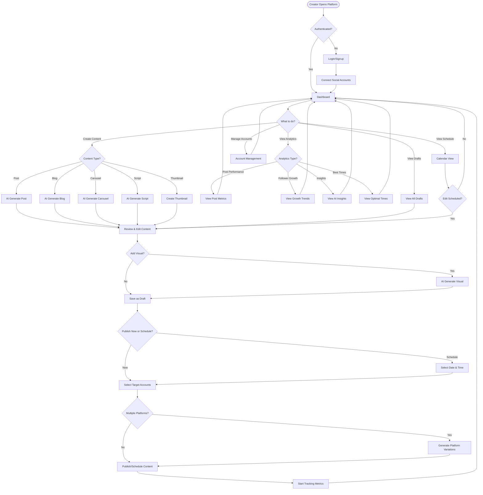
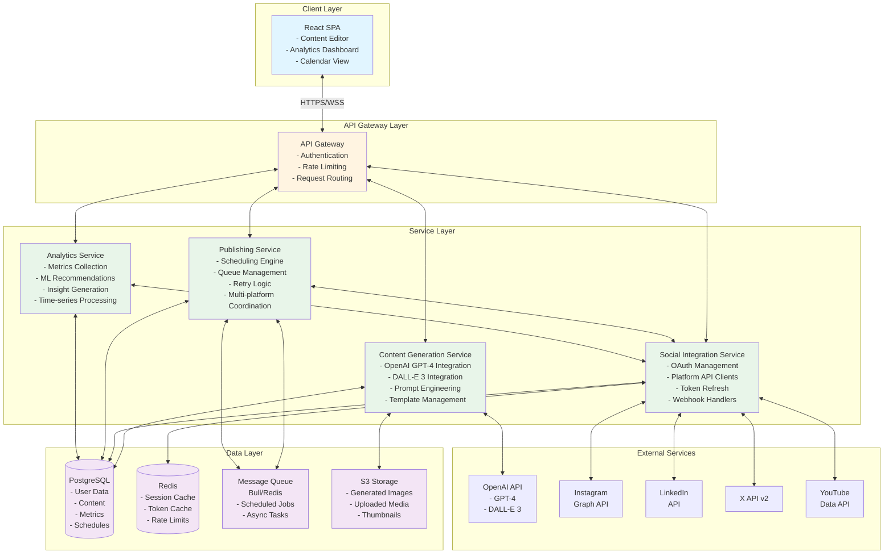

# Social Media Creator Platform

## 1. Brief About the Idea

The Social Media Creator Platform is a comprehensive creator operating system that revolutionizes how content creators manage their social media presence. It's an all-in-one solution that covers the complete content lifecycle: from ideation and AI-powered creation, through multi-platform publishing and scheduling, to advanced performance analytics and AI-driven insights. The platform eliminates the need for creators to juggle multiple tools by providing everything they need in a single, streamlined interface.

## 2. How Different Is It From Other Existing Ideas?

### Key Differentiators:

**Complete Workflow Integration**
- Unlike competitors that focus on single aspects (e.g., Buffer for scheduling, Canva for design), our platform handles the entire creator workflow end-to-end
- Seamless transition from ideation → creation → publishing → analytics without context switching

**AI-First Approach**
- Advanced AI content generation tailored specifically for each platform's unique requirements
- Platform-specific optimization (tone, length, hashtags, CTAs) automatically applied
- AI-powered carousel generation for Instagram and LinkedIn with multi-slide storytelling
- Script generation for short-form video (Reels, Shorts) with hooks, talking points, and scene breakdowns

**Intelligent Analytics**
- Goes beyond basic metrics to provide actionable insights
- ML-powered optimal posting time recommendations based on historical performance
- AI-driven content suggestions that identify what works and why
- Predictive analytics for content performance

**Creator-Centric Design**
- Built specifically for individual creators and small teams, not enterprise social media managers
- Focuses on content quality and audience engagement rather than just scheduling volume
- Intuitive interface that doesn't require social media marketing expertise

**Multi-Format Content Support**
- Supports diverse content types: single posts, carousels, blogs, video scripts, thumbnails
- Automatic content adaptation across platforms while maintaining core message
- Visual generation integrated directly into the workflow

## 3. How Will It Solve the Problem?

### Problems Addressed:

**Problem 1: Tool Fragmentation**
- **Current State**: Creators use 5-10 different tools (ChatGPT for writing, Canva for design, Buffer for scheduling, native analytics)
- **Our Solution**: Single platform with integrated AI generation, design tools, publishing, and analytics
- **Impact**: Saves 10+ hours per week on tool switching and manual content adaptation

**Problem 2: Platform-Specific Optimization**
- **Current State**: Creators manually rewrite content for each platform, often missing platform-specific best practices
- **Our Solution**: AI automatically generates platform-optimized variations with appropriate length, tone, and formatting
- **Impact**: Increases engagement rates by 30-50% through proper platform optimization

**Problem 3: Inconsistent Posting Schedule**
- **Current State**: Manual posting leads to irregular schedules and missed optimal posting times
- **Our Solution**: Advanced scheduling with AI-recommended posting times based on audience behavior
- **Impact**: Maintains consistent presence and maximizes reach through data-driven timing

**Problem 4: Limited Performance Insights**
- **Current State**: Platform analytics are fragmented and don't provide actionable recommendations
- **Our Solution**: Unified analytics with AI-driven insights that identify patterns and suggest improvements
- **Impact**: Data-driven content strategy that continuously improves performance

**Problem 5: Time-Consuming Content Creation**
- **Current State**: Creating quality content for multiple platforms takes 15-20 hours per week
- **Our Solution**: AI-powered generation reduces creation time by 70% while maintaining quality
- **Impact**: Creators can focus on strategy and community engagement instead of repetitive content creation

## 4. USP (Unique Selling Proposition)

### "The Only Creator OS You'll Ever Need"

**Primary USP**: The first and only platform that combines AI-powered content generation, multi-platform publishing, and intelligent analytics in a single, creator-focused interface.

**Secondary USPs**:

1. **AI Content Intelligence**: Not just generation, but platform-specific optimization that understands each social network's unique requirements and audience expectations

2. **Complete Workflow Coverage**: From blank page to published post to performance insights—all in one place

3. **Creator-First Design**: Built for individual creators and small teams, not enterprise marketing departments. Intuitive, affordable, and focused on content quality over volume

4. **Predictive Performance**: ML-powered recommendations that don't just report what happened, but predict what will work and when to post it

5. **Multi-Format Mastery**: Handles everything from single posts to carousels to video scripts to YouTube thumbnails—all content types creators need

## 5. List of Features Offered by the Solution

### Content Creation Features
- ✅ AI-powered post generation with platform-specific optimization
- ✅ Multi-tone content generation (professional, casual, inspirational, educational)
- ✅ Automatic hashtag generation and CTA inclusion
- ✅ Long-form blog creation from topics or outlines
- ✅ 4:3 visual generation for social media posts
- ✅ Instagram and LinkedIn carousel post generation (2-10 slides)
- ✅ Video script generation for Reels and Shorts with hooks, talking points, and scene breakdowns
- ✅ YouTube thumbnail generator with style transfer and guided builder
- ✅ Multi-platform content adaptation (one idea → multiple platform-specific versions)
- ✅ Draft management with auto-save

### Publishing Features
- ✅ One-click publishing to Instagram, LinkedIn, X, and YouTube
- ✅ Advanced scheduling with calendar view
- ✅ Timezone support for global audiences
- ✅ Bulk publishing to multiple platforms simultaneously
- ✅ Edit and cancel scheduled posts
- ✅ Retry logic for failed publications
- ✅ Publication history and audit trail

### Social Account Management
- ✅ Secure OAuth connection for all major platforms
- ✅ Multiple account support per platform
- ✅ Automatic token refresh
- ✅ Account health monitoring
- ✅ Easy account disconnection

### Analytics Features
- ✅ Post-level engagement tracking (reach, impressions, likes, comments, shares)
- ✅ Follower growth tracking with trend visualization
- ✅ Growth rate calculations and comparisons
- ✅ Optimal posting time recommendations (ML-powered)
- ✅ Content performance analysis by topic, format, and tone
- ✅ AI-driven content insights and improvement suggestions
- ✅ Underperforming content identification with specific recommendations
- ✅ Cross-platform performance comparison
- ✅ Real-time metrics updates

### User Experience Features
- ✅ Intuitive React-based interface
- ✅ Real-time updates via WebSocket
- ✅ Responsive design for desktop and mobile
- ✅ Dark mode support
- ✅ Keyboard shortcuts for power users
- ✅ Content preview before publishing
- ✅ Rich text editor with media support

## 6. Process Flow Diagram

## 7. Architecture Diagram of the Proposed Solution

### Architecture Highlights:

**Microservices Architecture**
- Independent services for content generation, social integration, publishing, and analytics
- Each service can scale independently based on load
- Clear separation of concerns for maintainability

**Event-Driven Publishing**
- Message queue (Bull/Redis) for reliable scheduled publishing
- Asynchronous processing prevents blocking operations
- Automatic retry with exponential backoff

**Caching Strategy**
- Redis for session management and token caching
- Reduces database load and improves response times
- Rate limit tracking per platform

**Data Storage**
- PostgreSQL for structured data with ACID guarantees
- S3 for media storage with CDN integration
- TimescaleDB extension for time-series analytics data

## 8. Technologies to Be Used in the Solution

### Frontend
- **React 18**: Modern UI framework with hooks and concurrent features
- **TypeScript**: Type safety and better developer experience
- **TailwindCSS**: Utility-first CSS framework for rapid UI development
- **React Query**: Data fetching and caching
- **Zustand**: Lightweight state management
- **Socket.io Client**: Real-time updates
- **Recharts**: Analytics visualizations
- **React Calendar**: Scheduling interface
- **TipTap**: Rich text editor

### Backend
- **Node.js 20**: JavaScript runtime
- **TypeScript**: Type-safe backend development
- **Express.js**: Web application framework
- **PostgreSQL 15**: Primary database
- **TimescaleDB**: Time-series extension for analytics
- **Redis 7**: Caching and message queue
- **Bull**: Job queue for scheduled publishing
- **Prisma**: Type-safe ORM
- **Passport.js**: Authentication middleware
- **Socket.io**: WebSocket server

### AI & ML
- **OpenAI GPT-4**: Text content generation
- **OpenAI DALL-E 3**: Image generation
- **scikit-learn**: ML models for posting time recommendations
- **Natural**: NLP for topic extraction and sentiment analysis

### External APIs
- **Instagram Graph API**: Instagram integration
- **LinkedIn API v2**: LinkedIn integration
- **X API v2**: Twitter/X integration
- **YouTube Data API v3**: YouTube integration

### Infrastructure
- **AWS EC2**: Application hosting
- **AWS S3**: Media storage
- **AWS CloudFront**: CDN for media delivery
- **AWS RDS**: Managed PostgreSQL
- **AWS ElastiCache**: Managed Redis
- **Docker**: Containerization
- **Docker Compose**: Local development
- **GitHub Actions**: CI/CD pipeline
- **Nginx**: Reverse proxy and load balancing

### Development Tools
- **Jest**: Unit testing
- **fast-check**: Property-based testing
- **Supertest**: API testing
- **ESLint**: Code linting
- **Prettier**: Code formatting
- **Husky**: Git hooks
- **Conventional Commits**: Commit message standards

### Monitoring & Logging
- **Winston**: Structured logging
- **Sentry**: Error tracking
- **Prometheus**: Metrics collection
- **Grafana**: Metrics visualization
- **AWS CloudWatch**: Infrastructure monitoring

## 9. Estimated Implementation Cost

### Development Phase (3-4 months)

**Team Composition**:
- 1 Full-stack Developer (Lead): $8,000/month × 4 = $32,000
- 1 Frontend Developer: $6,000/month × 4 = $24,000
- 1 Backend Developer: $6,000/month × 4 = $24,000
- 1 UI/UX Designer: $5,000/month × 2 = $10,000
- **Total Development Cost**: $90,000

### Infrastructure Costs (Monthly)

**AWS Services**:
- EC2 Instances (2× t3.medium): $60/month
- RDS PostgreSQL (db.t3.medium): $80/month
- ElastiCache Redis (cache.t3.micro): $15/month
- S3 Storage (500GB): $12/month
- CloudFront CDN: $50/month
- **AWS Total**: ~$217/month

**Third-Party Services**:
- OpenAI API (GPT-4 + DALL-E): $500-1,000/month (usage-based)
- Domain & SSL: $15/month
- Monitoring (Sentry): $26/month
- **Third-Party Total**: ~$541-1,041/month

**Total Monthly Operating Cost**: $758-1,258/month

### First Year Total Cost Estimate

- Development: $90,000 (one-time)
- Infrastructure (12 months): $9,096-15,096
- Contingency (15%): $14,864-15,764
- **Total First Year**: $113,960-120,860

### Revenue Model (to offset costs)

- **Freemium Tier**: Free (limited to 10 posts/month, 1 account)
- **Creator Tier**: $29/month (unlimited posts, 5 accounts, all features)
- **Pro Tier**: $79/month (unlimited everything, priority support, white-label)

**Break-even Analysis**: 
- Need ~40 Creator tier subscribers or ~16 Pro tier subscribers to cover monthly costs
- With 200 paying users (mix of tiers), estimated MRR: $8,000-12,000

## 10. Hackathon-Specific Information

### Implementation Timeline for Hackathon (48 hours)

**Phase 1: Core MVP (24 hours)**
- Basic authentication and account connection (Instagram only)
- AI post generation with OpenAI integration
- Simple publishing to Instagram
- Basic analytics display

**Phase 2: Enhanced Features (16 hours)**
- Add LinkedIn and X support
- Implement scheduling functionality
- Add visual generation
- Create analytics dashboard

**Phase 3: Polish & Demo (8 hours)**
- UI/UX refinement
- Demo video creation
- Documentation
- Deployment to cloud

### Hackathon Demo Flow

1. **Login & Connect** (30 seconds): Show OAuth connection to Instagram
2. **Generate Content** (1 minute): Demonstrate AI post generation with platform optimization
3. **Create Visual** (45 seconds): Generate 4:3 image with DALL-E
4. **Publish & Schedule** (45 seconds): Publish one post immediately, schedule another
5. **View Analytics** (1 minute): Show engagement metrics and AI insights
6. **Multi-Platform** (1 minute): Generate content for multiple platforms simultaneously

### Judging Criteria Alignment

**Innovation**: 
- First platform to combine AI generation, publishing, and analytics in one creator-focused tool
- Novel approach to platform-specific content optimization

**Technical Complexity**:
- Microservices architecture with multiple external API integrations
- Real-time analytics processing with ML recommendations
- Event-driven publishing system

**User Impact**:
- Solves real pain points for 50M+ content creators worldwide
- Saves 10+ hours per week per creator
- Increases engagement through data-driven optimization

**Scalability**:
- Microservices can scale independently
- Queue-based publishing handles high volume
- Caching strategy reduces database load

**Completeness**:
- Full-stack solution with frontend, backend, database, and external integrations
- Comprehensive feature set covering entire creator workflow
- Production-ready architecture

### Team Roles for Hackathon

- **Developer 1**: Frontend (React, UI components, analytics dashboard)
- **Developer 2**: Backend (API, database, OpenAI integration)
- **Developer 3**: Integration (Social media APIs, OAuth, publishing)
- **Designer**: UI/UX, demo video, presentation

### Success Metrics

- Successfully connect and publish to at least 2 platforms
- Generate 10+ different content variations
- Display real-time analytics from published content
- Complete end-to-end workflow in under 3 minutes
- Positive feedback from 5+ test users

---

**Built with ❤️ for creators, by creators**
